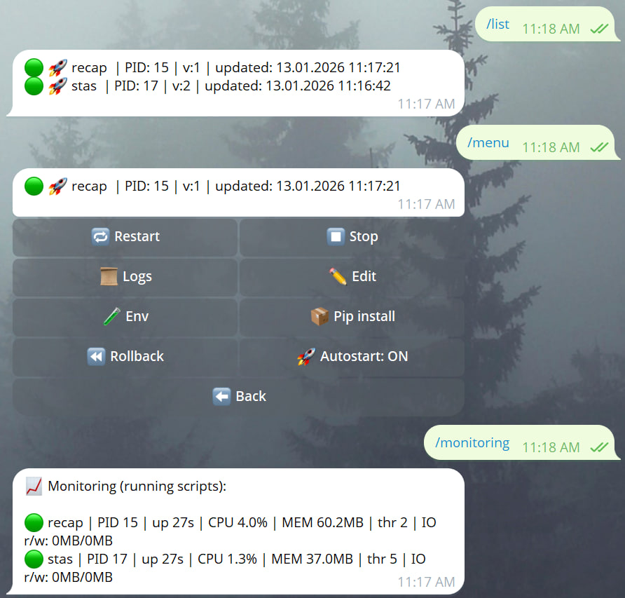

# PyManager 🤖🧰
A Telegram bot to manage Python scripts from chat: upload/edit, run/stop/restart, logs, env vars, autostart, version rollback, and basic monitoring.



Designed for **single-owner** usage (restricted by `OWNER_ID`).

---

## Features
- **Scripts**: upload `.py` as a file or paste as text, run/stop/restart, tail logs
- **ENV**: global env + per-script env, optional env key detection from code
- **Autostart**: run selected scripts automatically when the manager starts
- **Rollback**: keeps **last 10 versions** per script with timestamps, one-click rollback
- **Monitoring**: `/monitoring` shows CPU/MEM for running scripts (**psutil**)

---

## Data layout
Stored under `DATA_DIR` (default `/data`, mounted as a volume in Docker):

- `scripts/` — current scripts (`<name>.py`)
- `versions/<script_id>/` — saved versions (`<script_id>_<timestamp>.py`)
- `logs/` — per-script logs (`<script_id>.log`)
- `meta.json` — scripts metadata (env/autostart/versions)
- `requirements.txt` — saved dependencies (from `/pip ...`)

---

## Run with Docker Compose

### 1) Create `.env`
```env
BOT_TOKEN=123456:ABCDEF_your_token_here
OWNER_ID=123456789
```

### 2) `docker-compose.yml` example
```yaml
version: "3.8"

services:
  pymanager:
    build: .
    container_name: pymanager
    restart: unless-stopped
    environment:
      BOT_TOKEN: "${BOT_TOKEN}"
      OWNER_ID: "${OWNER_ID}"
      DATA_DIR: "/data"
    volumes:
      - ./data:/data
```

### 3) Start
```bash
docker compose up -d --build
```

Logs:
```bash
docker compose logs -f pymanager
```

Stop:
```bash
docker compose down
```

---

## Main bot commands
- `/menu` — interactive scripts menu (buttons)
- `/new <name>` — create script (send code as the next message)
- `/run <id>` — start script
- `/stop <id>` — stop script
- `/logs <id>` — show last log lines
- `/monitoring` — CPU/MEM for running scripts (install psutil if needed)
- `/pip <args>` — install packages and save into `requirements.txt`

---

## Notes
- Access is restricted to **OWNER_ID**.
- Dependencies installed via `/pip` are persisted in `requirements.txt` and installed on manager startup.

---

## License
Apache-2.0 (see `LICENSE`)
