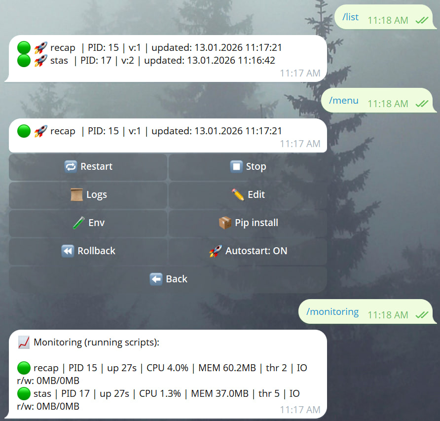

# PyManager 🤖🧰
A Telegram bot to manage Python scripts and apps from chat: upload/edit, run/stop/restart, logs, env vars, autostart, version rollback, and basic monitoring.



Designed for **single-owner** usage (restricted by `OWNER_ID`).

---

## Features
- **📄 Scripts**: upload `.py` as a file or paste as text, run/stop/restart, tail logs
- **📦 Apps from archives**: send a `.zip` / `.tar.gz` / `.tgz` / `.tar` / `.7z` file
  - Auto-extracted; the app name is the archive name (without extension)
  - Auto-detects `requirements.txt` and offers to install it
  - Auto-detects the entry point: `main.py` if present, the single `.py` file if there's
    only one, or asks you which file to run otherwise
  - Gets its **own isolated virtualenv** so its dependencies never affect other apps
- **🌐 Apps from GitHub repos**: just paste a link (or use `/repo <url>`)
  - `https://github.com/owner/repo` — imports the whole repo, name = repo name
  - `https://github.com/owner/repo/tree/branch/subdir` — imports only `subdir`,
    name = `repo-subdir`
  - **🔄 Sync** button re-pulls the repo, offers to install any new dependencies,
    and restarts the app
- **🧪 ENV**: global env + per-script/app env, optional env key detection from code
  (scans all `.py` files for apps, same detection logic as before for scripts)
- **🚀 Autostart**: run selected scripts/apps automatically when the manager starts
- **⏪ Rollback**: keeps **last 10 versions** per script/app with timestamps, one-click rollback
- **📈 Monitoring**: `/monitoring` shows CPU/MEM for running scripts/apps (**psutil**)

### Isolation model
- Each **app** (from an archive or a GitHub repo) gets its own Python virtualenv under
  `venvs/<app_id>/`, created with `--system-site-packages`. This means:
  - Installing a dependency for one app **never** impacts another app.
  - The only thing shared between all apps (and the manager itself) is whatever is
    installed system-wide in the image — i.e. `python-telegram-bot` and `psutil`.
- **Legacy single-file scripts** (`.py` upload/paste) keep working exactly as before:
  they share the manager's own interpreter and `requirements.txt`. This keeps existing
  setups 100% backward-compatible — nothing changes for scripts you already have.

---

## Data layout
Stored under `DATA_DIR` (default `/data`, mounted as a volume in Docker):

- `scripts/` — current legacy scripts (`<name>.py`)
- `versions/<script_id>/` — saved script versions (`<script_id>_<timestamp>.py`)
- `apps/<app_id>/` — current app source tree (from an archive or a GitHub repo)
- `app_versions/<app_id>/` — saved app versions (`<app_id>_<timestamp>.tar.gz`)
- `venvs/<app_id>/` — isolated virtualenv per app
- `gitrepos/<app_id>/` — working git clone backing a GitHub app (used by Sync)
- `logs/` — per-script/app logs (`<id>.log`)
- `meta.json` — scripts/apps metadata (type/env/autostart/versions/entry/...)
- `requirements.txt` — shared dependencies for legacy scripts (from `/pip ...`)

---

## Run with Docker Compose

### 1) Create `.env`
```env
BOT_TOKEN=123456:ABCDEF_your_token_here
OWNER_ID=123456789
```

### 2) `docker-compose.yml` example
```yaml
version: "3.8"

services:
  pymanager:
    build: .
    container_name: pymanager
    restart: unless-stopped
    environment:
      BOT_TOKEN: "${BOT_TOKEN}"
      OWNER_ID: "${OWNER_ID}"
      DATA_DIR: "/data"
    volumes:
      - ./data:/data
```

### 3) Start
```bash
docker compose up -d --build
```

Logs:
```bash
docker compose logs -f pymanager
```

Stop:
```bash
docker compose down
```

---

## Main bot commands
- `/menu` — interactive scripts/apps menu (buttons)
- `/list` — rich status list of all scripts/apps
- `/new <name>` — create a script (send code as the next message)
- `/repo <github_url>` — import an app from a GitHub repo (or just paste the link)
- `/run <id>` — start script/app
- `/stop <id>` — stop script/app
- `/logs <id>` — show last log lines
- `/monitoring` — CPU/MEM for running scripts/apps (install psutil if needed)
- `/pip <args>` — install packages (shared `requirements.txt` for scripts, per-app venv + `requirements.txt` for apps)

### Importing an app
- Just **send an archive file** (`.zip`/`.tar.gz`/`.tgz`/`.tar`/`.7z`) — the bot unpacks it,
  detects `requirements.txt` and the entry point, and gets you set up.
- Or **send a GitHub link** as a plain message, e.g.:
  - `https://github.com/owner/repo`
  - `https://github.com/owner/repo/tree/main/subdir`
- Legend in menus: `📄` script · `📦` archive app · `🌐` GitHub app.

---

## Notes
- Access is restricted to **OWNER_ID**.
- Dependencies installed via `/pip` for legacy scripts are persisted in `/data/requirements.txt`
  and installed on manager startup; for apps they go into the app's own venv +
  its own `requirements.txt`. (Not to be confused with the repo-root `requirements.txt`,
  which lists the manager's own runtime dependencies and is installed in the `Dockerfile`.)
- `git` and `py7zr` are required in the runtime image to clone repos / extract `.7z`
  archives — already included in the provided `Dockerfile`.

---

## Development & tests
Unit tests cover the venv isolation, archive extraction (incl. path-traversal
safety), entry-point detection, GitHub import/sync, BWC of legacy scripts, and
version/rollback handling (including the timestamp-collision edge case).

Run them locally:
```bash
pip install -r requirements-dev.txt
pytest -v
```

The `test` job in `.github/workflows/build-and-deploy.yml` runs the full suite
on every push to `main`; `build-and-push` (and therefore `deploy`) only runs
if it's green.

---

## License
Apache-2.0 (see `LICENSE`)
